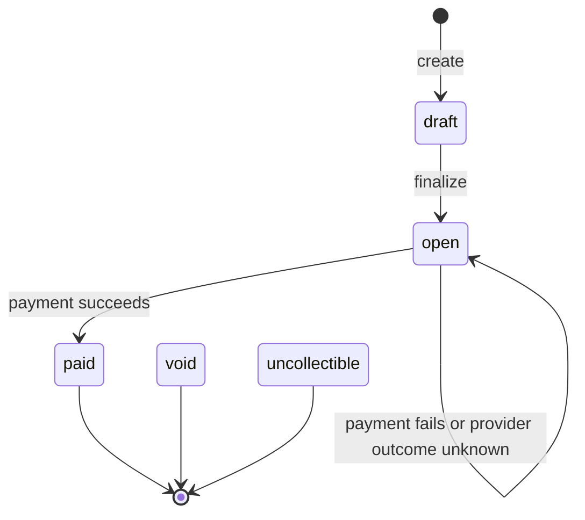

# Design Document

## 1. Data Model

The API is tenant-scoped. Tenants own customers, invoices, payments, webhook registrations, and delivery rows. Customers own invoice references. Invoices store integer cents, USD currency, line items, an invoice state, and the associated payment ID. Payments store the tenant-scoped idempotency key, request fingerprint, provider result, and attempt count. Payment attempts preserve pending, succeeded, or failed provider outcomes independently of the payment summary. Webhook registrations hold an outbound URL and signing secret; webhook delivery rows are the PostgreSQL transactional outbox and retain exact payload bytes, event type, attempts, lease, retry time, and exhaustion state.

## 2. Invoice State Machine

Invoices are never `pending` or `failed`. Payment attempts use those outcomes. The API exposes finalization for `draft → open`; payment is accepted only from `open`. `paid`, `void`, and `uncollectible` are terminal. Void/uncollectible mutation endpoints are intentionally outside this take-home.

## 3. Payment Correctness and Failure Modes

### Concurrent payment

The PostgreSQL claim transaction authenticates the tenant, locks the invoice with `SELECT ... FOR UPDATE`, checks the tenant+idempotency key and fingerprint, and creates one pending payment/attempt before committing. A second application instance waits for that row lock, observes the existing payment or active claim, and does not call the PSP. The PSP request is made only after the claim transaction commits; the row lock is not held over network I/O.

This guarantees one local payment claim per invoice. It does not claim exactly-once remote charging across a process crash.

### Idempotency reuse

The fingerprint is a versioned, length-delimited SHA-256 over invoice ID, payment token, amount, and uppercase currency. Matching tenant/key/fingerprint requests replay the persisted response body/status without a PSP call when complete. A matching in-flight claim returns `202 Accepted` with pending payment data; callers do not synchronously receive the eventual result. A changed fingerprint returns `409 Conflict`. The unique `(tenant_id, idempotency_key)` constraint allows independent tenants to reuse a key. Raw tokens are not persisted or logged.

### PSP timeout and network failure

The service deadline is two seconds while the timeout fixture waits thirty seconds. A timeout is unknown, not proof of failure: the payment attempt remains `pending`, the invoice remains `open`, and a retry does not blindly initiate another charge. Confirmed decline/insufficient/network failure is a failed attempt and also leaves the invoice open. The mock PSP has no reconciliation API, so a real deployment needs provider-side idempotency and reconciliation.

### PSP success followed by crash

If the PSP accepts a charge and the process dies before finalization, the local attempt remains pending. The service cannot know whether the remote charge succeeded. It therefore avoids automatic retries and does not claim exactly-once external charging.

### Already paid

A paid invoice is returned without another PSP call. Terminal invoices cannot be paid again.

## 4. Webhook Design

Invoice creation inserts `invoice.created` delivery rows in the same transaction as the draft invoice. Payment finalization inserts `invoice.paid` or `invoice.payment_failed` rows in the same transaction as the payment/attempt/invoice update. The API returns after commit and does not wait for destination HTTP calls.

The worker claims due rows using `FOR UPDATE SKIP LOCKED` and a lease. It sends the stored raw bytes with `Content-Type: application/json`, `X-Webhook-Timestamp`, and `X-Webhook-Signature: sha256=<hex>`. The HMAC input is exactly `timestamp + "." + raw_payload`; consumers should reject timestamps outside a five-minute replay window. Failed deliveries retry exactly five times: attempt 1 immediately, then +5 seconds, +30 seconds, +5 minutes, and +30 minutes. After attempt five, the row is exhausted with its last error retained. The retry schedule helper and PostgreSQL lease/exhaustion test cover the policy.

Inbound webhook signatures are checked against raw bytes before JSON parsing, scoped to the authenticated tenant and registration, and duplicate event IDs are idempotent.

## 5. API Key Model

Bootstrap keys use `prefix_secret`. PostgreSQL stores the prefix and SHA-256 hash of the secret, never the raw key. Authentication resolves a tenant, and every repository lookup includes that tenant ID. This prevents cross-tenant customer, invoice, payment, and webhook access.

## 6. What We Cut and Why

This assignment intentionally excludes subscriptions, recurring billing, plans, proration, refunds, partial payments, multi-currency, FX, tax calculation, frontend work, Redis/Kafka/RabbitMQ/Kubernetes, and unnecessary distributed infrastructure. PostgreSQL transactions and one delivery worker provide the required durability without adding a broker or service boundary.

## 7. Production Readiness Gap

Before real money, the service needs a PSP with stable idempotency and reconciliation, stronger secret storage and rotation, metrics/tracing/alerts, operational replay tooling, rate limiting, audit/compliance controls, backup/restore testing, and failure-injection testing. The mock PSP crash window remains an explicit limitation.
