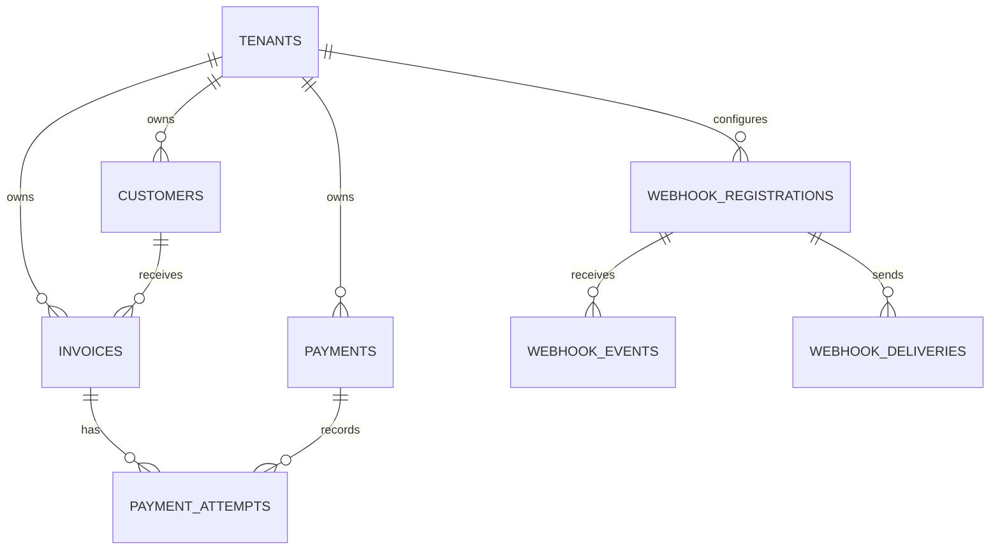
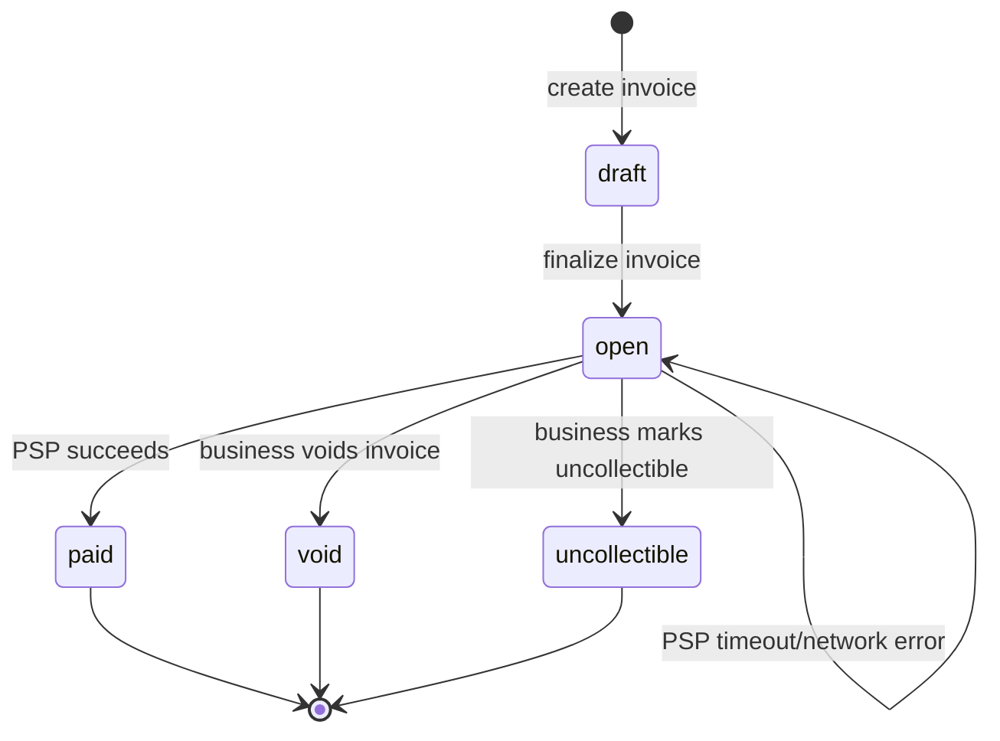

# Dodo Payments — Design Document

## 1. Data Model

The service uses PostgreSQL as the durable runtime store when `DATABASE_URL` is configured. UUIDs are generated by the application and used as public identifiers so IDs are not sequentially enumerable. All monetary values are signed 64-bit integer cents; the API accepts USD only and never uses floating point.

| Table | Shape and indexes | Design rationale and 100x change |
|---|---|---|
| `tenants` | UUID primary key, name, API-key prefix/hash, timestamps; unique prefix index | A tenant is the business boundary used in every authorization query. The secret is never stored. At 100x scale I would separate businesses from a versioned `api_keys` table to support multiple active keys and independent revocation/rotation. |
| `customers` | UUID primary key, tenant foreign key, name, email; index `(tenant_id, id)` | Customer data is intentionally small and normalized because invoices reference it. Tenant-qualified lookup prevents cross-business access. At 100x scale I would add normalized email/search indexes and pagination. |
| `invoices` | UUID primary key, tenant/customer foreign keys, integer amount, USD currency check; line items use `unit_amount_cents`, state, due date, JSON line items, payment reference; indexes `(tenant_id, state)` and `(tenant_id, customer_id)` | Line items are kept as JSON for this small take-home, while the computed total is stored as the authoritative read value. A separate line-item table would be preferable for reporting-heavy workloads; at 100x scale I would use that table, partition large invoice histories, and add an immutable invoice-event table. |
| `payments` | UUID primary key, tenant foreign key, amount/currency, status, provider reference, idempotency key, request fingerprint, attempt count; unique `(tenant_id, idempotency_key)` | The payment is the durable idempotency and provider-result record. The tenant-qualified unique key prevents one business from colliding with another. At 100x scale I would retain an immutable idempotency-response table and partition by tenant/time. |
| `payment_attempts` | UUID primary key, payment foreign key, status, provider reference/error, timestamp; index on payment | Attempts preserve each provider try independently from the current payment summary. This supports failure analysis without overwriting history. |
| `webhook_registrations` | UUID primary key, tenant foreign key, URL, signing secret, active flag | Registration ownership is tenant-scoped. Production would encrypt secrets using a key-management service. |
| `webhook_events` | UUID, registration foreign key, provider event ID, exact payload bytes, received timestamp; unique `(registration_id, event_id)` | Exact bytes allow signature verification and replay-safe ingestion. At 100x scale this would be partitioned/retained separately from outbound work. |
| `webhook_deliveries` | UUID, registration/event references, payload, attempt count, next-attempt time, lease/error/dead metadata, delivered timestamp; due-row index | This is an outbox for outbound delivery. It decouples payment latency from destination availability and lets multiple workers use `SKIP LOCKED`. |

## 2. Invoice State Machine

The service uses `draft`, `open`, `paid`, `void`, and `uncollectible`. Creation produces `draft`; an explicit finalization operation may move `draft` to `open`; only `open` can be paid. `paid`, `void`, and `uncollectible` are terminal.

The only reversible-looking transition is an unresolved payment remaining `open`; it is not a state reversal. A pending payment attempt can later resolve through a signed provider event, but a terminal invoice never returns to `draft` or `open`. The repository validates state while holding the invoice row lock. Invalid transitions return `409 Conflict`; unknown or tenant-mismatched IDs return `404`.

## 3. Payment Correctness & Failure Modes

### (a) Two clients pay simultaneously

The Postgres path locks the invoice with `SELECT ... FOR UPDATE` in the invoice-payment transaction. It checks the state, idempotency record, and active payment attempt while holding that lock. Only one transaction can claim the invoice operation. The other request sees the resulting payment/invoice state and replays it or receives a conflict. The provider call is not made while holding a long database transaction; the local pending claim is committed before network I/O, then a short finalization transaction locks the payment again. This avoids connection/lock starvation while preserving a single local charge claim.

### (b) `tok_timeout`

The mock PSP sleeps for 30 seconds. The invoice service has a two-second HTTP deadline. A timeout is therefore an unknown provider outcome, not a confirmed decline: the payment attempt remains `pending`, the invoice remains `open`, and the endpoint returns a documented pending/timeout response. The caller retrieves the invoice and payment-attempt status. A later signed provider webhook or reconciliation lookup can resolve the attempt. The service never blindly creates a second charge for an unknown result.

### (c) PSP succeeds, then the service crashes

The local database cannot prove whether a remote PSP accepted a request if the process dies before finalization. The attempt remains pending/unknown. Retrying the same idempotency key replays the durable local operation rather than blindly creating another local payment. Because the mock provider does not offer a real lookup/idempotency API, exactly-once external charging cannot be claimed; production would pass a stable provider idempotency key and reconcile by provider reference.

### (d) Idempotency key changes body

The request fingerprint covers the invoice/payment inputs. The same tenant and key with the same fingerprint replays the original result without another PSP call. The same key with a different fingerprint returns `409 Conflict`. Keys are tenant-scoped and checked under the database lock.

### (e) Already-paid invoice

A paid invoice is terminal. A new pay request returns the existing terminal state (or a clear `409` according to the endpoint contract) and does not call the PSP. It cannot create a second successful payment.

## 4. Webhook Design

Inbound webhooks are verified over the exact raw request bytes using HMAC-SHA256 and the registration secret. The signature is checked before JSON parsing and the registration is resolved within the authenticated tenant. The event is inserted with a unique `(registration_id, event_id)` identity; duplicate delivery returns success without applying the transition twice. A payment transition and outbound delivery enqueue occur in one database transaction.

The worker claims due rows using `FOR UPDATE SKIP LOCKED` and an expiring lease. It sends the stored exact payload with an HMAC signature, a bounded HTTP timeout, and retry schedule of approximately 1s, 2s, 4s, then bounded delays. Deliveries stop at the configured maximum attempt count and become exhausted/dead with the last error retained. The API does not wait on destinations: it commits an outbox row and returns. A business reconciles exhausted events by inspecting delivery status and fetching current invoice/payment state; production would expose a replay endpoint and metrics.

## 5. API Key Model

A development bootstrap key has the form `prefix_secret`. The prefix is indexed for lookup; only a SHA-256 hash of the secret is stored. The raw key is supplied through `X-API-Key` (Bearer support remains available for local tests), never logged or returned after bootstrap. Every repository query carries the authenticated tenant ID. Revocation is represented by the key's active/revoked state in the durable model; rotation means issuing a new prefix/secret and disabling the old key. A leaked key grants only that tenant's API scope, but remains a credential requiring rotation.

## 6. What We Cut and Why

- Refunds, partial payments, subscriptions, tax, and multi-currency were excluded because they introduce separate money/state models unrelated to the required payment attempt flow.
- Kafka, Redis, queues, and Kubernetes were excluded; PostgreSQL outbox rows and one worker demonstrate the required delivery semantics without infrastructure sprawl.
- A real PSP reconciliation API was excluded because the assignment supplies only a mock PSP; the crash-window limitation is documented instead of hidden.
- Production-grade rate limiting, dashboards, and full audit/compliance controls were excluded and listed as follow-up work.

## 7. Production Readiness Gap

The top three gaps before handling real money would be: (1) a provider with stable idempotency and reconciliation plus stronger secret management; (2) metrics, tracing, audit events, alerting, and operational replay tooling for payments/webhooks; and (3) formal security/compliance work including rate limiting, key lifecycle controls, PCI boundaries, backup/restore, and failure-injection testing. The demo video remains a manual submission artifact rather than a runtime feature.
